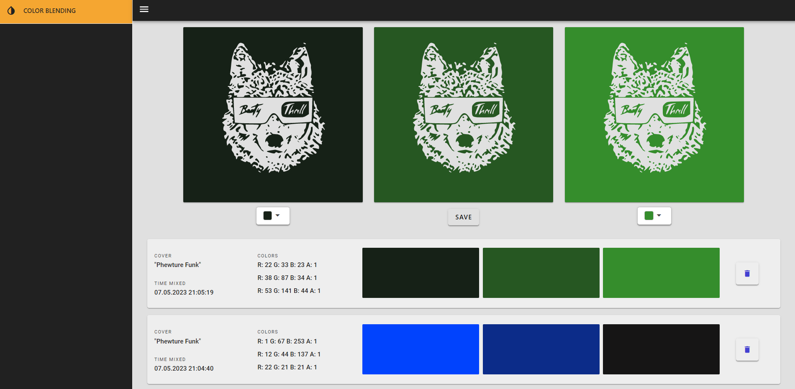

  

# Project description
A sample Blazor application, that contains a color blending tool.
## Introduction
The project is aimed at learning languages and usage of libraries. It was built with [BootStrap](https://getbootstrap.com/) and [Radzen](https://www.nuget.org/packages/Radzen.Blazor) packages to provide and test different UI components.
## Added:
- real-time blend
## Things to do:
- multiple blend steps
- edit blend function
- cover search with SVG converter
- add more color tools
